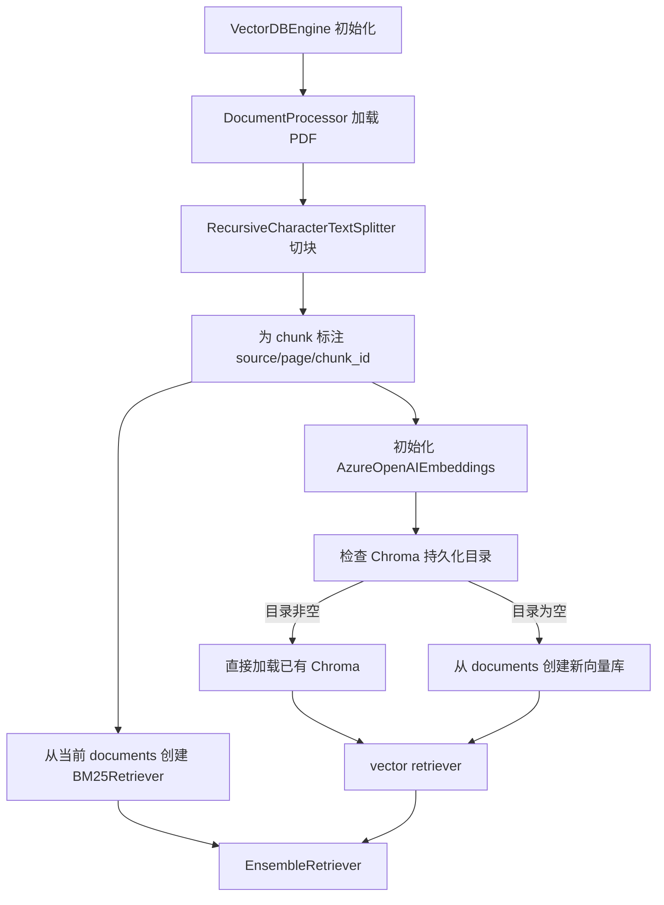

# 项目 RAG 模块技术文档

> 更新时间：2026-04-20  
> 适用对象：新加入项目的后端、算法、全栈同学  
> 文档目标：基于仓库当前代码，说明项目 RAG 模块现在实际是怎么工作的、依赖什么、有哪些边界、有哪些风险、与主流 RAG 工程实践相比处于什么位置。

---

## 1. 一页结论

当前项目的 RAG 模块已经接入主运行链路，不是停留在实验脚本阶段。用户从前端发起文本聊天后，后端会根据问题内容在 SQL 和 RAG 之间做启发式路由；当问题走 RAG 路径时，系统会从本地 PDF 文档中做混合检索，然后再调用 Azure OpenAI 生成回答，并把 citations 返回给前端展示。

当前最重要的几个事实如下：

- **RAG 已接主链路**：主入口在 [server/app.py](server/app.py)，运行时通过 `_run_rag()` 调用 RAG。
- **真实检索入口是 `ensemble_retriever`**：主服务实际使用的是 [server/vectorDB_Agent/vectorDB_Engine.py](server/vectorDB_Agent/vectorDB_Engine.py) 中构建的 `ensemble_retriever`，而不是 `VectorDBEngine.chain`。
- **当前是混合检索**：向量检索使用 Chroma，关键词检索使用 BM25，两者通过 LangChain 的 `EnsembleRetriever` 组合。
- **知识源来自本地 PDF**：当前文档源位于 [server/data/Restaurants_data](server/data/Restaurants_data)，实际存在 10 份 PDF。
- **回答会带来源信息**：后端返回 `source`、`page`、`chunk_id`，前端会在 assistant message 中显示 citations。
- **多轮能力有限**：会话历史虽然被存储，但当前 RAG 生成时没有真正把历史消息送进 LLM，多轮上下文利用不完整。
- **评测资产已存在但不完全可用**：项目里有 22 条 QA/Golden 数据用于测试，但部分测试脚本已经和当前实现漂移。

一句话概括当前状态：

**这是一个已经跑通的、以 LangChain + Chroma + BM25 + Azure OpenAI 为核心的 RAG 原型系统，但还没有完成向生产级 RAG 工程的收敛。**

---

## 2. RAG 模块在整个系统里的位置

这个项目并不是纯 RAG 应用，而是一个“SQL + RAG 混合问答系统”。因此理解 RAG 模块时，必须先明确边界：

- RAG 负责回答来自非结构化文档的问题，例如餐厅介绍、评论、指南、攻略类问题。
- Text-to-SQL 负责回答更偏结构化计算、筛选、统计的问题，例如 count、average、top、price、reviews、menu 等。
- 两条链路都由 [server/app.py](server/app.py) 编排。

当前后端路由逻辑：

- 如果问题中出现 `how many`、`count`、`average`、`top`、`price`、`menu`、`reviews` 等关键词，优先走 SQL。
- 否则默认走 RAG。
- 如果首选链路不可用，会做一次降级 fallback。

这意味着：

- RAG 模块不是孤立存在的，而是系统问答能力的一半。
- 文档里所有“现状判断”都必须放在 SQL/RAG 混合编排的背景下看。

---

## 3. 当前代码结构与职责划分

下面只列和 RAG 直接相关、且对理解当前系统有价值的模块。

### 3.1 主链路模块

- [server/app.py](server/app.py)
  - 主服务入口。
  - 负责请求接入、会话管理、SQL/RAG 路由、RAG 生成、citations 返回。

- [server/vectorDB_Agent/vectorDB_Engine.py](server/vectorDB_Agent/vectorDB_Engine.py)
  - RAG 引擎核心类。
  - 负责加载文档、初始化 embeddings、加载或创建 Chroma、构建 BM25Retriever、组合成 EnsembleRetriever。

- [server/vectorDB_Agent/document_processor.py](server/vectorDB_Agent/document_processor.py)
  - PDF 文档加载与切分。
  - 负责统一 chunk 策略和 metadata 标注。

### 3.2 实验/增强模块

- [server/vectorDB_Agent/vector_store_agent.py](server/vectorDB_Agent/vector_store_agent.py)
  - 一个较早的向量检索封装。
  - 当前不在主服务运行路径中。

- [server/vectorDB_Agent/bm25_retriever_agent.py](server/vectorDB_Agent/bm25_retriever_agent.py)
  - 基于 Whoosh + BM25 的关键词检索实验模块。
  - 当前不在主服务运行路径中。

- [server/vectorDB_Agent/query_pre_processor.py](server/vectorDB_Agent/query_pre_processor.py)
  - 用 LLM 先抽取 query entities，再做关键词检索。
  - 当前不在主服务运行路径中。

- [server/vectorDB_Agent/llm_post_processor.py](server/vectorDB_Agent/llm_post_processor.py)
  - 对召回文档做后处理/总结的实验模块。
  - 当前不在主服务运行路径中。

- [server/vectorDB_Agent/combined_keyword_retriever.py](server/vectorDB_Agent/combined_keyword_retriever.py)
  - 把 `query_pre_processor` 和 `bm25_retriever_agent` 串起来的组合检索模块。
  - 当前不在主服务运行路径中。

### 3.3 测试与评测资产

- [server/tests/qa_keywords.json](server/tests/qa_keywords.json)
  - 22 条 query keyword 评测数据。

- [server/tests/golden_standard_Raw_Chunks.json](server/tests/golden_standard_Raw_Chunks.json)
  - 22 条原始召回评测数据。

- [server/tests/golden_standard_extracted_chunks.json](server/tests/golden_standard_extracted_chunks.json)
  - 22 条后处理结果评测数据。

- [server/vectorDB_Agent/tests](server/vectorDB_Agent/tests)
  - 包含 query pre-processing、BM25、vector store、LLM post-processing 等模块测试。
  - 其中部分脚本与当前运行时接口存在漂移。

---

## 4. 端到端流程总览

### 4.1 用户请求到回答返回的主流程

```mermaid
flowchart TD
    A[前端发送 /chat-text/] --> B[server/app.py]
    B --> C{_route(question)}
    C -->|默认| D[_run_rag]
    C -->|包含 SQL 提示词| E[_run_sql]
    D --> F[get_rag_engine]
    F --> G[VectorDBEngine]
    G --> H[ensemble_retriever.invoke(question)]
    H --> I[app.py 拼接 CONTEXT 与 citations]
    I --> J[get_llm in app.py]
    J --> K[AzureChatOpenAI 生成答案]
    K --> L[返回 answer + citations + route]
    L --> M[前端展示消息与 Sources]
```

### 4.2 RAG 引擎初始化流程



---

## 5. 当前 RAG 详细执行链路

这一节按“真实运行时”拆开讲，不按类设计意图讲。

### 5.1 请求进入后端

用户在前端输入问题后：

- 前端通过 [client/src/apiService.ts](client/src/apiService.ts) 调用 `POST /chat-text/`。
- 会话 id 通过 `X-Session-Id` 头部传递并保存在 `localStorage` 中。
- 后端在 [server/app.py](server/app.py) 中把消息加入当前 session history。

值得注意的是：

- 会话历史当前只是被保存和返回给前端。
- RAG 生成阶段并没有把这些历史消息真正传入模型。
- [server/app.py](server/app.py) 中虽然有 `_history_to_lc_messages()`，但当前没有被主流程使用。

### 5.2 路由阶段

后端调用 `_route(question)` 做启发式判断：

- 命中 SQL 倾向关键词，则优先走 SQL。
- 未命中则走 RAG。
- 如果目标引擎不可用，再 fallback 到另一条链路。

对 RAG 模块的影响：

- 并不是所有“餐厅问题”都会进入 RAG。
- 一些既可由文档回答、又带有 `reviews`、`price`、`menu` 等关键词的问题，当前可能被优先路由到 SQL。
- 这不是 classifier，也不是 tool-calling，只是规则启发式。

### 5.3 RAG 引擎懒加载

当问题被路由到 RAG 后：

- `get_rag_engine()` 会懒加载一个全局 `VectorDBEngine` 实例。
- 初始化失败时会记录日志，并让 `_run_rag()` 返回“文档搜索当前不可用”的兜底提示。

这个设计的优点：

- 启动时不一定因为向量库或 Azure 配置错误直接崩掉。
- 只有在真正用到 RAG 时才初始化相关资源。

这个设计的限制：

- 失败原因只写日志，不会做更细粒度恢复。
- 当前没有健康检查项来细分“服务活着”和“RAG 可用”。

### 5.4 文档加载与切块

[server/vectorDB_Agent/document_processor.py](server/vectorDB_Agent/document_processor.py) 负责这一步。

当前实现细节：

- 数据源目录： [server/data/Restaurants_data](server/data/Restaurants_data)
- 文档格式：PDF
- 当前 PDF 数量：10
- 加载器：`PyPDFLoader`
- 切块器：`RecursiveCharacterTextSplitter`
- `chunk_size = 2000`
- `chunk_overlap = 400`
- `add_start_index = True`

切块后会补充稳定 metadata：

- `source`：PDF 文件名
- `page`：页码，已从 0-based 转成 1-based
- `chunk_index`：同一页中的 chunk 序号
- `chunk_id`：格式为 `文件名#p页码c序号`

这一层做得比较扎实的点：

- metadata 结构清晰，适合直接透传到 citations。
- chunk_id 可读性较好，便于排查召回来源。

### 5.5 向量索引构建

[server/vectorDB_Agent/vectorDB_Engine.py](server/vectorDB_Agent/vectorDB_Engine.py) 中的 `_setup_vector_store()` 负责向量库部分。

当前实现：

- embeddings 使用 `AzureOpenAIEmbeddings`
- 向量库使用 `Chroma`
- 持久化目录： [server/data/vectorDB/chroma](server/data/vectorDB/chroma)

处理逻辑：

- 如果持久化目录为空，则用当前 documents 创建新的 Chroma。
- 如果持久化目录非空，则直接加载已有 Chroma。

这带来一个非常重要的现实问题：

- **当前没有“文档变更检测”或“索引重建策略”。**
- 如果 PDF 文档已经更新，但 Chroma 目录依旧存在，向量检索侧会继续使用旧索引。
- 同时，BM25 检索侧会使用当前启动时重新加载的最新 documents。
- 结果就是：**向量检索和 BM25 检索可能面向不同版本的数据。**

这是当前 RAG 模块最需要优先修正的问题之一。

### 5.6 关键词检索构建

当前主链路中的关键词检索使用的是 LangChain 的 `BM25Retriever`：

- 从当前内存中的 `documents` 直接构建
- 显式设置 `k = 5`

注意区分：

- 主运行链路使用的是 `BM25Retriever`
- [server/vectorDB_Agent/bm25_retriever_agent.py](server/vectorDB_Agent/bm25_retriever_agent.py) 里的 Whoosh 方案属于旁路实验模块，不是主服务现在实际使用的 BM25 路径

### 5.7 混合检索

当前混合检索通过 `EnsembleRetriever` 实现：

- 向量检索：来自 Chroma 的 retriever
- 关键词检索：来自 `BM25Retriever`
- 权重：`[0.5, 0.5]`

优点：

- 比纯向量检索更稳，尤其对餐厅名、地名、特色菜名等字面匹配场景有帮助。
- 对 PDF 这种结构不统一、表达风格差异较大的文档，hybrid retrieval 是合理选择。

当前不足：

- 没有额外 reranker。
- 没有 query rewriting、multi-query、metadata filtering。
- 向量检索的 `as_retriever()` 没有显式配置 `search_kwargs`，召回参数较隐式。

### 5.8 生成阶段

这是最容易被误解的一部分。

虽然 [server/vectorDB_Agent/vectorDB_Engine.py](server/vectorDB_Agent/vectorDB_Engine.py) 中构建了 `self.chain` 和 `run_query()`，但当前主服务并不直接调用它们。

当前真实生成路径如下：

1. [server/app.py](server/app.py) 直接执行 `engine.ensemble_retriever.invoke(question)`。
2. 取回文档后，在 `app.py` 里手动遍历每个 `Document`。
3. 从 metadata 提取 `source`、`page`、`chunk_id`。
4. 将每个文档内容截断到最多 1500 个字符。
5. 拼装成统一 `CONTEXT` 字符串。
6. 调用 `get_llm()` 返回的 AzureChatOpenAI 做回答生成。
7. 返回回答文本和 citations。

因此当前可以明确下结论：

- `VectorDBEngine` 的 **检索设施** 在主链路上。
- `VectorDBEngine.chain` 的 **完整 RAG chain** 不在主链路上。
- 运行时回答生成实际由 [server/app.py](server/app.py) 自己控制。

### 5.9 运行时 LLM 配置的“双轨”现象

项目里实际上存在两套 LLM 配置：

- 一套在 [server/vectorDB_Agent/vectorDB_Engine.py](server/vectorDB_Agent/vectorDB_Engine.py)
  - `temperature = 0`
  - `max_tokens = 3000`
  - 主要服务于 `self.chain`

- 一套在 [server/app.py](server/app.py)
  - `temperature = 0.2`
  - `max_tokens = 800`
  - 当前主服务 RAG 回答实际使用这一套

这意味着：

- 代码结构上存在一定重复。
- 如果团队成员只看 `VectorDBEngine`，会误以为那套 prompt/LLM 参数就是线上行为。
- 但线上真实行为是 `app.py` 的系统 prompt 和参数决定的。

### 5.10 citations 如何形成并返回给前端

在 `_run_rag()` 中，每个召回文档都会产出一条 citation：

- `source`
- `page`
- `chunk_id`

前端 [client/src/ChatMessage.tsx](client/src/ChatMessage.tsx) 会把 assistant message 的 citations 渲染成一个可展开的 `Sources` 区域。

这说明当前系统已经具备基本的“可追溯回答”能力，而不是单纯返回一段黑盒文本。

---

## 6. 当前 RAG 依赖的库、服务与工具

这一节只列对 RAG 真正有价值的关键依赖，不列所有包。

### 6.1 核心 Python 库

基于 [server/requirements.txt](server/requirements.txt) 当前可以确认的关键依赖：

- `langchain==0.3.2`
- `langchain-community==0.3.1`
- `langchain-core==0.2.41`
- `langchain-openai==0.1.17`
- `langchain-text-splitters==0.3.0`
- `chromadb==0.5.4`
- `chroma-hnswlib==0.7.5`
- `pypdf==5.0.1`
- `rank-bm25==0.2.2`
- `Whoosh==2.7.4`
- `fastapi==0.115.0`
- `uvicorn==0.31.0`
- `python-dotenv==1.0.1`
- `azure-cognitiveservices-speech==1.40.0`（语音链路使用，不属于 RAG 核心）

### 6.2 外部服务

RAG 运行至少依赖以下 Azure 相关能力：

- Azure OpenAI Chat Model
- Azure OpenAI Embedding Model

对应环境变量见 [server/.env.example](server/.env.example)：

- `OPENAI_API_KEY`
- `AZURE_OPENAI_ENDPOINT`
- `AZURE_API_VERSION`
- `OPENAI_MODEL_4OMINI`
- `OPENAI_MODEL_4o`
- `OPENAI_MODEL_35`
- `OPENAI_EMBEDDING_MODEL`

### 6.3 数据与索引目录

- 文档源： [server/data/Restaurants_data](server/data/Restaurants_data)
- Chroma 持久化目录： [server/data/vectorDB/chroma](server/data/vectorDB/chroma)
- Whoosh 索引目录： [server/data/whoosh_index](server/data/whoosh_index)
  - 主要属于实验 BM25 模块使用

### 6.4 依赖版本漂移问题

项目里还有一个很实际的问题：

- [server/requirements.txt](server/requirements.txt) 和 [server/vectorDB_Agent/requirements.txt](server/vectorDB_Agent/requirements.txt) 并不完全一致。

例如：

- `langchain-openai` 在两份文件中的版本不同
- `langchain-core` 在两份文件中的版本不同
- `langchain` 本身的版本也不同

这说明：

- 当前仓库存在历史演进留下的环境漂移。
- 新同学如果混用两份 requirements，容易得到和主运行链路不一致的环境。

---

## 7. 当前评测与测试现状

### 7.1 已存在的评测资产

目前和 RAG 相关的评测数据规模如下：

- `qa_keywords.json`：22 条
- `golden_standard_Raw_Chunks.json`：22 条
- `golden_standard_extracted_chunks.json`：22 条

这些数据说明项目并不是完全没有评测意识，已经尝试把 RAG 流程拆成多个阶段做验证：

- query pre-processing
- raw retrieval
- post-processing
- end-to-end answer similarity

### 7.2 当前测试脚本的问题

当前测试存在明显漂移：

- [server/vectorDB_Agent/tests/vectorDB_Engine_test.py](server/vectorDB_Agent/tests/vectorDB_Engine_test.py) 仍然调用 `engine.qa_chain()` 和 `engine.return_unique_documents()`。
- 这两个接口在当前 [server/vectorDB_Agent/vectorDB_Engine.py](server/vectorDB_Agent/vectorDB_Engine.py) 中并不存在。

因此可以明确判断：

- 这份测试脚本已经不是和当前实现同步的测试。
- 它更像是历史版本遗留物。

其他测试脚本更多是在验证实验模块，不代表当前主服务端到端质量。

### 7.3 当前评测的价值与局限

价值：

- 项目已经有黄金数据集，不是纯靠人工感觉判断效果。
- 对 retrieval / post-processing 的拆分评测思路是对的。

局限：

- 目前没有统一的 CI 集成。
- 没有把“主服务真实调用链”作为唯一评测对象。
- 没有 reranker、route decision、fallback 行为的专项评测。

---

## 8. 当前 RAG 的优势

从工程视角看，当前实现已经具备以下优点：

- **结构清晰**：入口、索引、文档处理、旁路实验模块分层基本清楚。
- **已经真实接入产品链路**：不是只在 notebook 或脚本中运行。
- **混合检索路线合理**：对餐厅场景中的实体名、菜名、地点名比较友好。
- **citation 能力已经落地**：前后端都打通了来源展示。
- **懒加载降低启动失败风险**：适合 demo 阶段快速试验。
- **已有基础评测资产**：便于继续工程化。

---

## 9. 当前 RAG 的关键问题与风险

这一节是新人最需要重点看的部分。

### 9.1 运行时链路分裂

当前 RAG 相关逻辑分散在两处：

- 检索设施主要在 `VectorDBEngine`
- 真实生成主要在 `app.py`

结果：

- prompt、LLM 参数、chain 组织方式存在重复定义
- 代码阅读成本高
- 测试和真实运行行为容易脱节

### 9.2 向量索引缺少文档版本管理

这是当前最现实的工程风险。

- 只要 Chroma 目录存在，系统就直接加载旧索引。
- 当前没有 hash、manifest、mtime 比对，也没有强制重建开关。
- 文档更新后，向量检索可能继续使用旧内容。

### 9.3 会话历史没有真正进入 RAG 回答生成

虽然 session history 被保存了，但当前生成答案时只看：

- 当前问题
- 当前召回出来的 documents

这会带来：

- 追问场景表现弱
- 指代消解不稳定
- 多轮上下文无法有效复用

### 9.4 缺少 reranking

当前已经做了 hybrid retrieval，但还没有主流 RAG 系统常见的 reranker 层，例如：

- Cross-encoder reranker
- LLM reranker
- metadata-aware reranker

这会影响：

- top-k 的精确度
- 上下文窗口利用率
- citation 的可信度排序

### 9.5 缺少 metadata filtering 与 query rewriting

当前文档 metadata 已经有 `source`、`page`、`chunk_id`，但没有进一步做：

- 基于文档类别、来源、时间的过滤
- query expansion / rewriting
- multi-query retrieval
- self-query retrieval

这意味着当前检索是“可用”，但还不算“成熟”。

### 9.6 测试与主链路脱节

最大的表现是：

- 现有部分测试脚本跑的不是当前主链路
- 有些测试调用了已经不存在的接口

这会导致团队误以为“有测试就代表这条链路是被保护的”，但实际并不是。

### 9.7 依赖环境存在漂移

双 requirements 的版本不一致会导致：

- 环境复现困难
- 问题定位困难
- 新同学很难判断哪一套才是主环境

---

## 10. 与当前主流 RAG 框架的比较

这一节不讨论“迁移建议”，先讨论定位差异。

### 10.1 与 LangChain 主流用法的比较

当前项目本身已经建立在 LangChain 栈上，所以和 LangChain 的关系不是“是否使用”，而是“使用深度如何”。

| 维度     | 当前项目                                | 当前主流 LangChain 工程实践                                   |
| -------- | --------------------------------------- | ------------------------------------------------------------- |
| 编排方式 | 以函数调用和简单 LCEL 组合为主          | 更常见的是 LCEL + 明确 pipeline，复杂场景用 LangGraph         |
| 检索     | Chroma + BM25 hybrid                    | 常见做法与当前接近，但通常会再加 reranker/filtering           |
| 生成     | `app.py` 手动拼 context 调 LLM          | 更推荐把 retriever、formatter、prompt、generator 串成统一链路 |
| 会话     | 有 session store，但未真正进入 RAG 生成 | 常见做法会明确 memory 策略或直接采用无状态 QA                 |
| 可观测性 | 主要依赖日志                            | 主流做法通常会接 tracing、token/cost、retrieval metrics       |
| 评测     | 有离线测试数据                          | 更成熟实践会把 eval 接入 CI/CD 或定时回归                     |

结论：

- 当前项目已经在 LangChain 生态内部。
- 真正的差距不在“选错框架”，而在“工程化深度不够”。

### 10.2 与 LlamaIndex 风格方案的比较

LlamaIndex 的主流优势通常体现在：

- 更强调 index/node/query engine 的抽象
- 更容易组织多种索引策略
- 对 citation、node parser、retrieval pipeline 的概念更直接

相比之下，当前项目：

- 自己维护了较多索引与生成的拼接逻辑
- 没有形成更清晰的 query engine 抽象
- 文档更新与索引同步机制较弱

结论：

- 如果未来项目重点变成“知识库问答系统”，LlamaIndex 风格的 index-centric 设计会有参考价值。
- 但在当前代码基础上，继续收敛 LangChain 栈通常比直接迁移更现实。

### 10.3 与 Haystack 风格方案的比较

Haystack 的主流特点通常是：

- 检索、重排、生成、评测等 pipeline 化更明显
- 在生产化部署、组件化替换、离线实验上更规整

相比之下，当前项目：

- 更像“业务服务里内嵌 RAG 能力”
- 不像独立知识检索服务
- DAG 化、组件替换和实验管理能力较弱

结论：

- 当前项目更适合作为一个业务导向的应用后端。
- 如果未来要把 RAG 独立成平台能力，Haystack 类思路值得参考。

---

## 11. 与当前主流 RAG 流程的比较

主流 RAG 工程实践通常会包含以下环节：

1. Ingestion
2. Parsing / Chunking
3. Embedding / Indexing
4. Query Understanding
5. Retrieval
6. Reranking
7. Context Compression / Selection
8. Generation
9. Grounding / Citation
10. Evaluation / Observability
11. Feedback / Re-index

当前项目与这套主流流程的对比如下：

| 流程环节             | 当前项目状态 | 说明                                          |
| -------------------- | ------------ | --------------------------------------------- |
| Ingestion            | 已有         | 从本地 PDF 读取                               |
| Parsing / Chunking   | 已有         | `RecursiveCharacterTextSplitter`，2000/400    |
| Embedding / Indexing | 已有         | Azure embeddings + Chroma                     |
| Query Understanding  | 部分有       | 主链路没有；实验模块里有 query pre-processing |
| Retrieval            | 已有         | Chroma + BM25 hybrid                          |
| Reranking            | 缺失         | 当前没有单独 reranker                         |
| Context Compression  | 很弱         | 仅做每文档 1500 字符截断                      |
| Generation           | 已有         | `app.py` 调 AzureChatOpenAI                   |
| Grounding / Citation | 已有         | `source/page/chunk_id` 已返回前端             |
| Evaluation           | 部分有       | 有离线数据与脚本，但未统一收敛                |
| Observability        | 偏弱         | 主要靠日志                                    |
| Feedback / Re-index  | 缺失         | 没有文档变更检测和自动重建索引                |

结论：

- 当前项目已经覆盖了主流 RAG 流程中的核心骨架。
- 最大短板集中在“query understanding、reranking、index lifecycle、evaluation/observability”四块。

---

## 12. 建议的演进方向

下面是更适合当前项目阶段的改造顺序。

### 12.1 第一优先级：先把当前链路收敛

建议尽快完成：

- 把主运行时的检索与生成链路统一到一个明确的 RAG pipeline 中
- 消除 `app.py` 与 `VectorDBEngine` 双重定义 prompt / LLM / chain 的问题
- 为 Chroma 增加文档版本检测和重建机制
- 清理或修复已经漂移的测试脚本
- 统一 requirements，明确唯一主环境

这是“先把现有系统变得可信”的动作，不是追新功能。

### 12.2 第二优先级：提升检索质量

建议加入：

- reranker
- metadata filtering
- query rewriting 或 multi-query retrieval
- 可配置的 top-k 与 context budget 控制

这会直接改善：

- 召回精度
- 上下文质量
- 最终回答稳定性

### 12.3 第三优先级：补全工程化能力

建议加入：

- 端到端 eval 脚本，以当前主服务路径为准
- token、latency、retrieval hit、fallback 统计
- 更明确的 health/readiness 检查
- 文档入库/重建命令，而不是依赖“目录为空才建索引”

### 12.4 第四优先级：再考虑更复杂的框架能力

等前面三步做完，再考虑：

- 是否引入 LangGraph 管理更复杂工作流
- 是否把 RAG 从业务服务中拆成独立服务
- 是否引入更强的 retrieval orchestration 或 agent routing

当前阶段不建议一开始就迁移框架，因为主要问题并不是框架能力不够，而是现有能力尚未收敛。

---

## 13. 新同事建议阅读顺序

如果你刚加入项目，建议按下面顺序读代码：

1. [server/app.py](server/app.py)
   - 先理解真实请求怎么进入 RAG。

2. [server/vectorDB_Agent/vectorDB_Engine.py](server/vectorDB_Agent/vectorDB_Engine.py)
   - 理解混合检索怎么建起来。

3. [server/vectorDB_Agent/document_processor.py](server/vectorDB_Agent/document_processor.py)
   - 理解文档切块与 metadata。

4. [client/src/apiService.ts](client/src/apiService.ts)
   - 理解前端如何调用服务、如何维护 session。

5. [client/src/ChatMessage.tsx](client/src/ChatMessage.tsx)
   - 理解 citations 最终如何展示。

6. [server/vectorDB_Agent/tests](server/vectorDB_Agent/tests)
   - 最后再看测试与实验模块，不要一开始就把它们误认为主链路。

---

## 14. 最后的判断

从 tech lead 视角看，当前项目的 RAG 模块已经具备了一个合格原型该有的核心能力：

- 有真实数据源
- 有混合检索
- 有 LLM 生成
- 有 citations
- 有前后端打通
- 有一定评测资产

但它距离“稳定、可持续迭代、可被多人团队长期维护”的工程状态，还有几步关键工作没做完：

- 统一运行时链路
- 修复索引生命周期管理
- 让评测真正覆盖主链路
- 收敛依赖环境
- 补上 reranking 和更成熟的 query understanding

因此，最准确的结论不是“RAG 模块还没做完”，也不是“RAG 模块已经成熟”，而是：

**RAG 模块已经可用、已接主链路、适合继续迭代，但当前仍然明显处在原型到工程化的中间阶段。**
